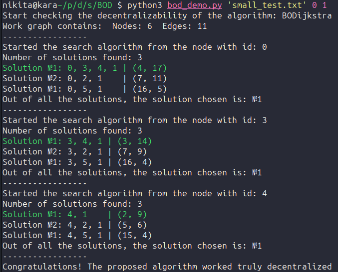

# Decentralized biobjective routing

This repository contains the results of my thesis, which investigated the applicability of modern State of The Art multi-objective search algorithms for solving the problem of decentralized routing.

The repository contains implementations of modern multi-criteria search algorithms. The code for these algorithms is located in the `src/mosp_algo` folder. This folder contains the algorithms described in the article: https://yeoh-lab.wustl.edu/assets/pdf/ai-HernandezYBZSKS23.pdf. Additionally, auxiliary data structures such as the Pareto set and PQD Tree are stored along with the algorithms.

The `src/routing` folder contains the routing methods themselves. Two methods are proposed in total - the **modeling method** and the **"greedy" method**. The first method is based on modeling the behavior of nodes and allows for a bounded and deterministic solution for any network, but requires consideration of the sender node when making decisions about packet transmission. The second method uses only information about the packet recipient but does not guarantee boundedness and determinism in the general case.

## Running tests

The repository also contains tools for verifying the decentralization of the solution, as well as tools for constructing test maps for multi-criteria search.

For testing, use the script `demo/bod_demo.py`, which uses packet tracing to verify the algorithm's functionality.

## Technical information / related publications
Carlos Hern ́andez Ulloa, William Yeoh,Jorge A. Baier, Han Zhang, Luis Suazo, Sven Koenig: [A Simple and Fast Bi-Objective Search Algorithm](https://ojs.aaai.org/index.php/ICAPS/article/view/6655)  

S Ahmadi, G Tack, DD Harabor, P Kilby: [Bi-objective Search with Bi-directional A*](https://ojs.aaai.org/index.php/SOCS/article/view/18563/18352)  

LHO Rios, L Chaimowicz: [PNBA*: A Parallel Bidirectional Heuristic Search Algorithm](https://dimap.ufrn.br/csbc2011/anais/eventos/contents/ENIA/ENIA_Sessao_6_Artigo_1_Rios.pdf)  

Zhongqiang Ren; Zachary B. Rubinstein; Stephen F. Smith; Sivakumar Rathinam; Howie Choset: [ERCA*: A New Approach for the Resource Constrained Shortest Path Problem](https://ieeexplore.ieee.org/abstract/document/10190205)  

Valmiki Kothare, Zhongqiang Ren, Sivakumar Rathinam, Howie Choset: [Enhanced Multi-Objective A* with Partial Expansion](https://arxiv.org/abs/2212.03712)

Saman Ahmadi, Guido Tack, Daniel Harabor, Philip Kilby, Mahdi Jalili: [Enhanced Methods for the Weight Constrained Shortest Path Problem](https://arxiv.org/abs/2207.14744)